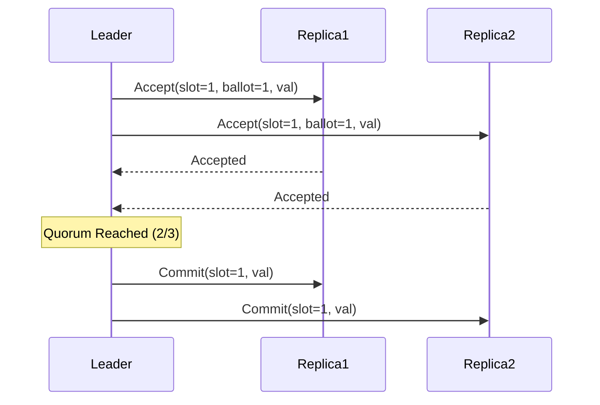

# Multi-Paxos Log Replication Engine Skill

Robust, zero-dependency Python implementation of **Multi-Paxos State Machine Replication** with leader lease optimizations.

## Features
- **Steady-State Phase 2 Consensus**: Replicates command logs in single round-trips when leader lease holds.
- **Safe Quorum Commit**: Guarantees serializability and crash-recovery consistency across distributed nodes.
- **Zero External Dependencies**: Pure Python standard library.
- **Native MCP Protocol**: JSON-RPC 2.0 stdio server compatible with Claude Desktop, Cursor, and Windsurf.

## Architecture

